# Easy Logic — Proof Guide

> Complete reference for all 30 natural deduction proofs, organized by difficulty level.

---

## Rules Reference

| Rule | Abbreviation | Inputs | Description |
|------|-------------|--------|-------------|
| Assume | — | User input | Opens a subproof with an assumption |
| Modus Ponens | MP | `P`, `P → Q` | Derive `Q` |
| Modus Tollens | MT | `P → Q`, `¬Q` | Derive `¬P` |
| ∧ Introduction | ∧I | `P`, `Q` | Derive `P ∧ Q` |
| ∧ Elimination Left | ∧EL | `P ∧ Q` | Derive `P` |
| ∧ Elimination Right | ∧ER | `P ∧ Q` | Derive `Q` |
| ∨ Introduction Left | ∨IL | `P` + user input `Q` | Derive `P ∨ Q` |
| ∨ Introduction Right | ∨IR | `P` + user input `Q` | Derive `Q ∨ P` |
| Double Negation | DN | `¬¬P` | Derive `P` (or vice versa) |
| → Introduction | →I | Subproof `A ⊢ B` | Close subproof, derive `A → B` |
| ∨ Elimination | ∨E | `P ∨ Q`, `P → C`, `Q → C` | Derive `C` |
| Disjunctive Syllogism | DS | `P ∨ Q`, `¬P` | Derive `Q` (or `¬Q` → `P`) |
| Law of Excluded Middle | LEM | User input `P` | Introduce `P ∨ ¬P` |

---

## Level 1 — Simple Direct Rules (1–3 steps)

### Proof 1: Basic Modus Ponens

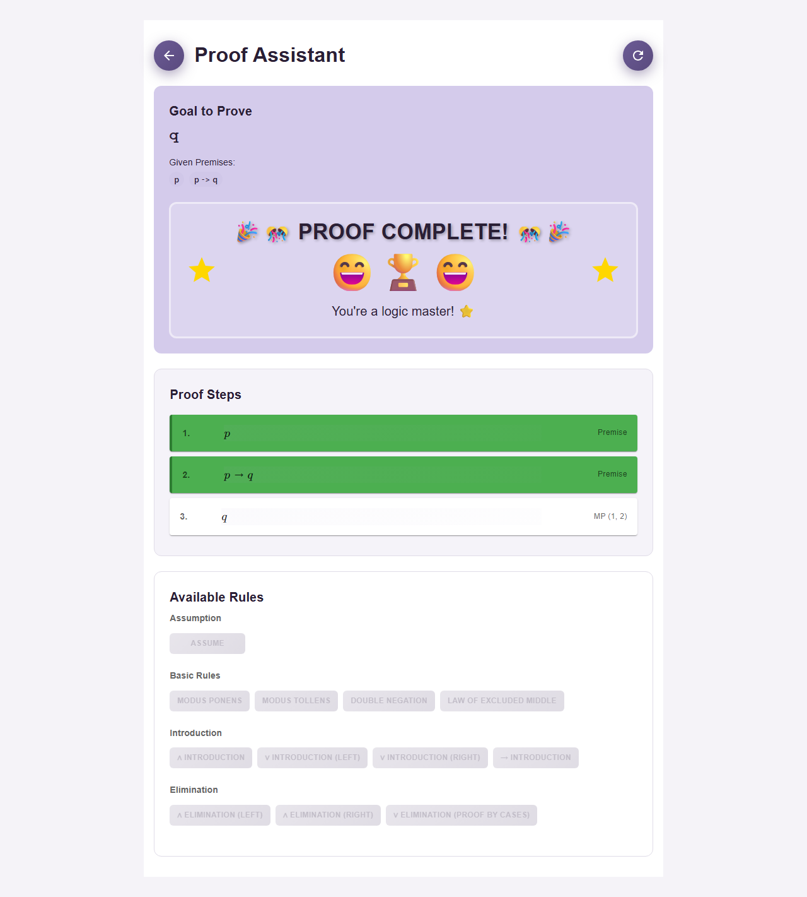

- **Goal:** `q`
- **Premises:** `p`, `p → q`
- **Knowledge Base:** Modus Ponens

| Step | Formula | Justification |
|------|---------|---------------|
| 1 | `p` | Premise |
| 2 | `p → q` | Premise |
| 3 | `q` | Modus Ponens (1, 2) |

**Key idea:** The most fundamental inference rule — given `P` and `P → Q`, conclude `Q`.

---

### Proof 2: Conjunction Introduction

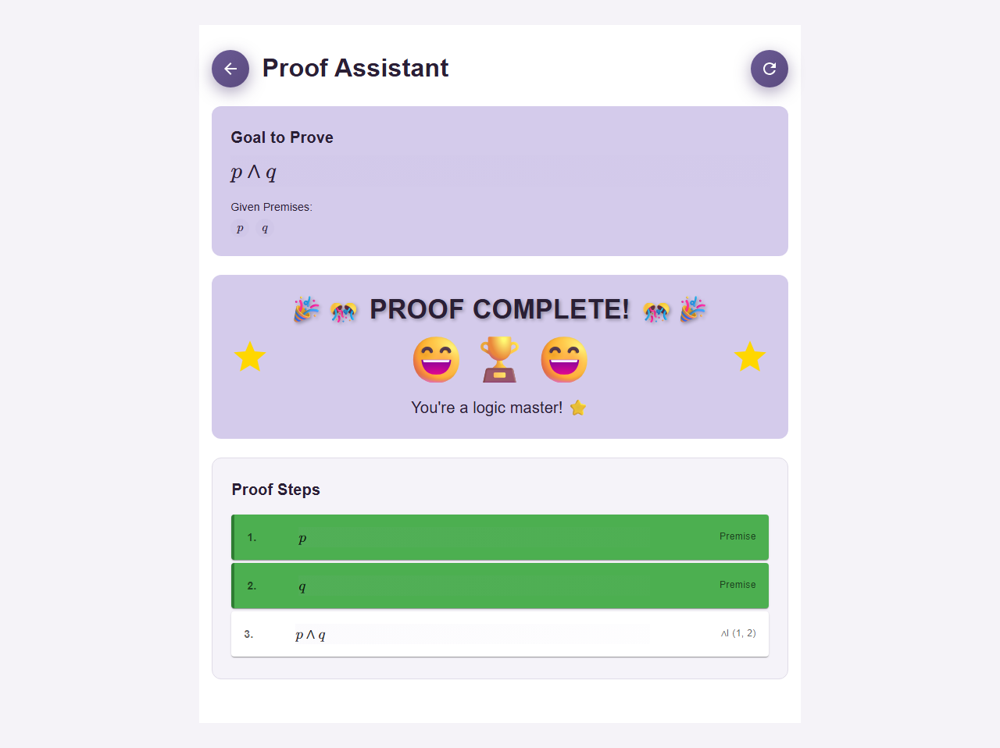

- **Goal:** `p ∧ q`
- **Premises:** `p`, `q`
- **Knowledge Base:** Conjunction

| Step | Formula | Justification |
|------|---------|---------------|
| 1 | `p` | Premise |
| 2 | `q` | Premise |
| 3 | `p ∧ q` | ∧ Introduction (1, 2) |

**Key idea:** Combine two known propositions into a conjunction.

---

### Proof 3: Conjunction Elimination Left

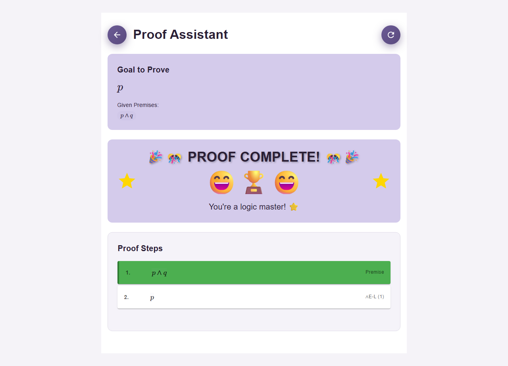

- **Goal:** `p`
- **Premises:** `p ∧ q`
- **Knowledge Base:** Conjunction Elimination

| Step | Formula | Justification |
|------|---------|---------------|
| 1 | `p ∧ q` | Premise |
| 2 | `p` | ∧ Elimination Left (1) |

**Key idea:** Extract the left component from a conjunction.

---

### Proof 4: Conjunction Elimination Right

- **Goal:** `q`
- **Premises:** `p ∧ q`
- **Knowledge Base:** Conjunction Elimination

| Step | Formula | Justification |
|------|---------|---------------|
| 1 | `p ∧ q` | Premise |
| 2 | `q` | ∧ Elimination Right (1) |

**Key idea:** Extract the right component from a conjunction.

---

### Proof 5: Disjunction Introduction Left

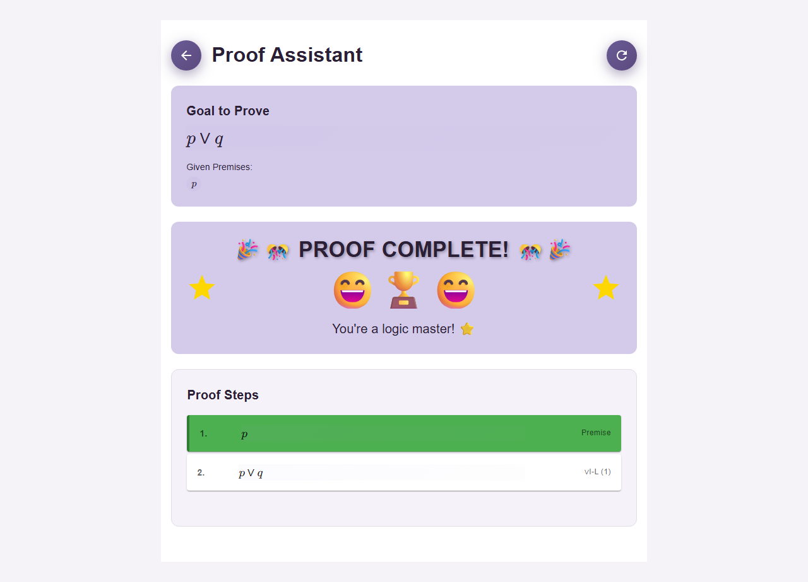

- **Goal:** `p ∨ q`
- **Premises:** `p`
- **Knowledge Base:** Disjunction

| Step | Formula | Justification |
|------|---------|---------------|
| 1 | `p` | Premise |
| 2 | `p ∨ q` | ∨ Introduction Left (1), user provides `q` |

**Key idea:** From any proposition `P`, derive `P ∨ Q` for any `Q`.

---

### Proof 6: Double Negation Elimination

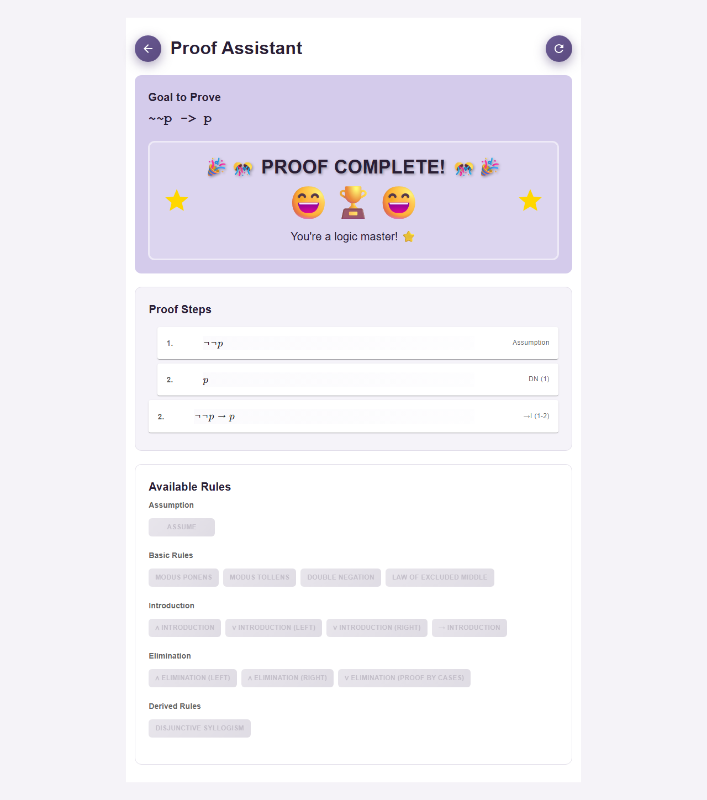

- **Goal:** `¬¬p → p`
- **Premises:** None

| Step | Formula | Justification |
|------|---------|---------------|
| 1 | ┃ `¬¬p` | Assume (opens subproof) |
| 2 | ┃ `p` | Double Negation (1) |
| 3 | `¬¬p → p` | → Introduction (1–2) |

**Key idea:** Double negation cancels out. Uses a subproof to package the result as an implication.

---

## Level 2 — Multiple Steps (3–5 steps)

### Proof 7: Chained Modus Ponens

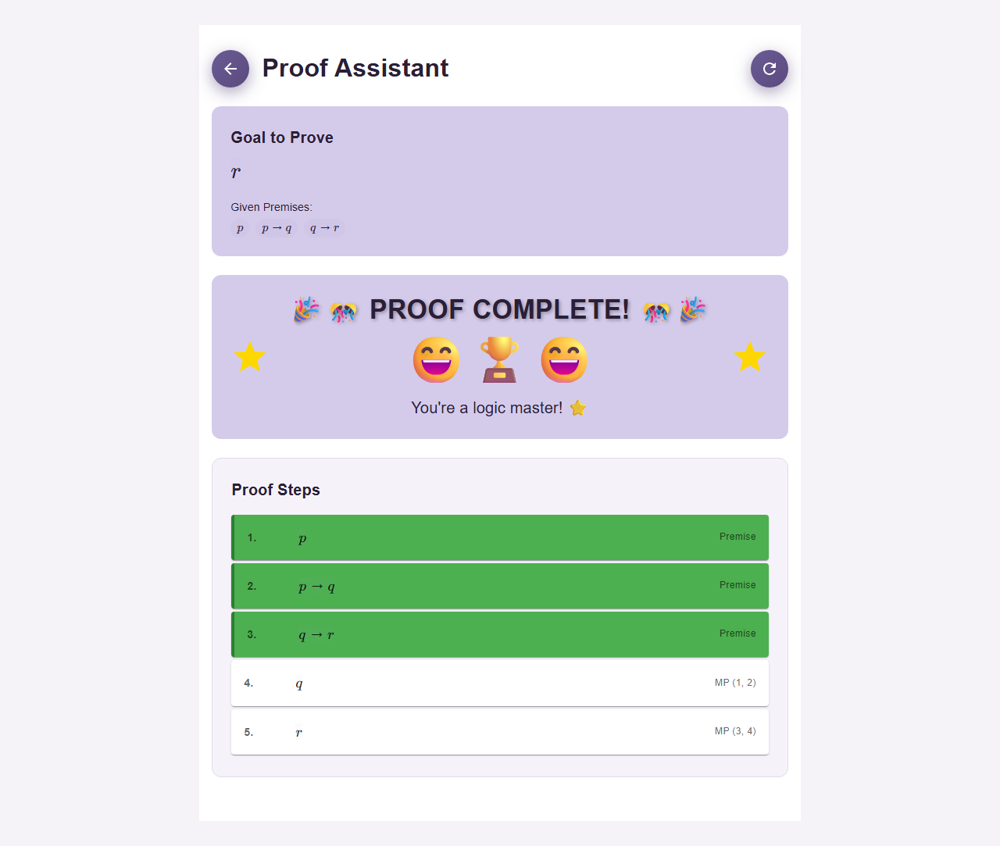

- **Goal:** `r`
- **Premises:** `p`, `p → q`, `q → r`
- **Knowledge Base:** Hypothetical Syllogism

| Step | Formula | Justification |
|------|---------|---------------|
| 1 | `p` | Premise |
| 2 | `p → q` | Premise |
| 3 | `q → r` | Premise |
| 4 | `q` | Modus Ponens (1, 2) |
| 5 | `r` | Modus Ponens (4, 3) |

**Key idea:** Chain two implications — if `P → Q` and `Q → R`, then `P` leads to `R` via two Modus Ponens applications.

---

### Proof 8: Conjunction Elimination + Modus Ponens

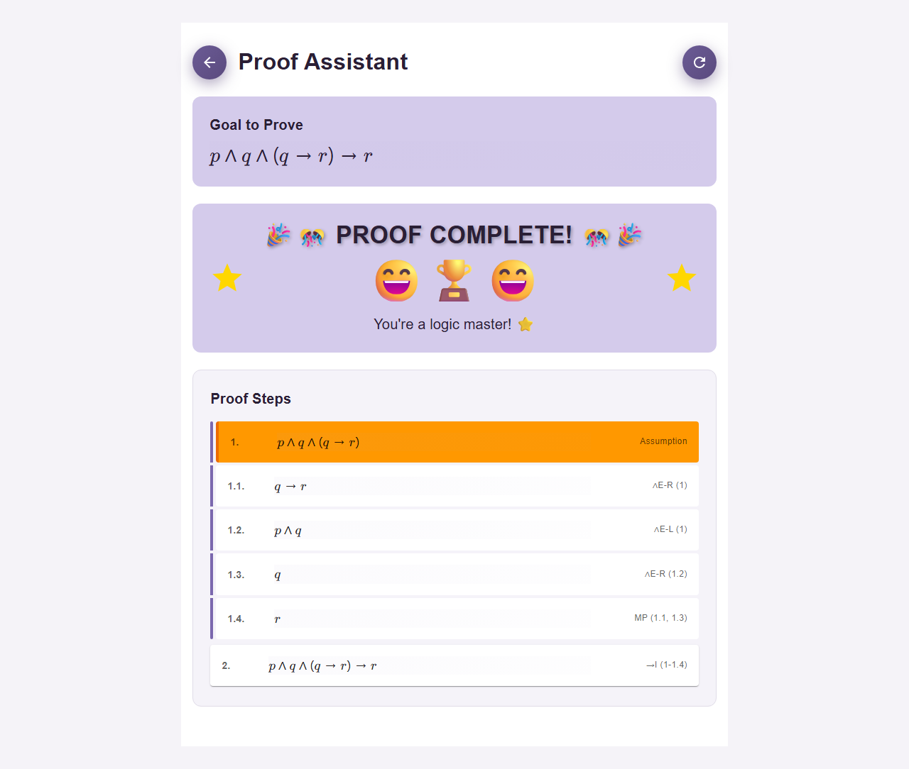

- **Goal:** `(p ∧ q) ∧ (q → r) → r`
- **Premises:** None (custom goal)

| Step | Formula | Justification |
|------|---------|---------------|
| 1 | ┃ `(p ∧ q) ∧ (q → r)` | Assume (opens subproof) |
| 2 | ┃ `q → r` | ∧ Elimination Right (1) |
| 3 | ┃ `p ∧ q` | ∧ Elimination Left (1) |
| 4 | ┃ `q` | ∧ Elimination Right (3) |
| 5 | ┃ `r` | Modus Ponens (4, 2) |
| 6 | `((p ∧ q) ∧ (q → r)) → r` | → Introduction (1–5) |

**Key idea:** Decompose a conjunction to extract both the argument and the implication, then apply Modus Ponens.

---

### Proof 9: Modus Tollens

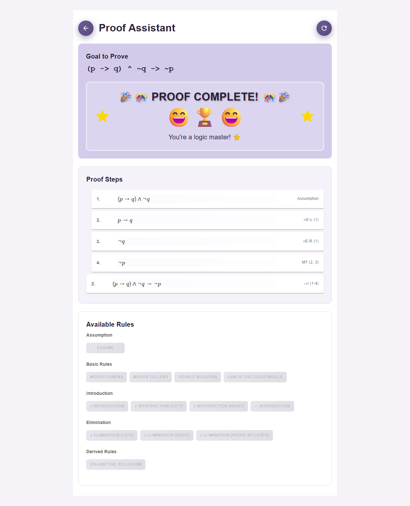

- **Goal:** `(p → q) ∧ ¬q → ¬p`
- **Premises:** None (custom goal)

| Step | Formula | Justification |
|------|---------|---------------|
| 1 | ┃ `(p → q) ∧ ¬q` | Assume (opens subproof) |
| 2 | ┃ `p → q` | ∧ Elimination Left (1) |
| 3 | ┃ `¬q` | ∧ Elimination Right (1) |
| 4 | ┃ `¬p` | Modus Tollens (2, 3) |
| 5 | `((p → q) ∧ ¬q) → ¬p` | → Introduction (1–4) |

**Key idea:** The contrapositive of Modus Ponens — if `P → Q` and `¬Q`, then `¬P`.

---

### Proof 10: Disjunctive Syllogism

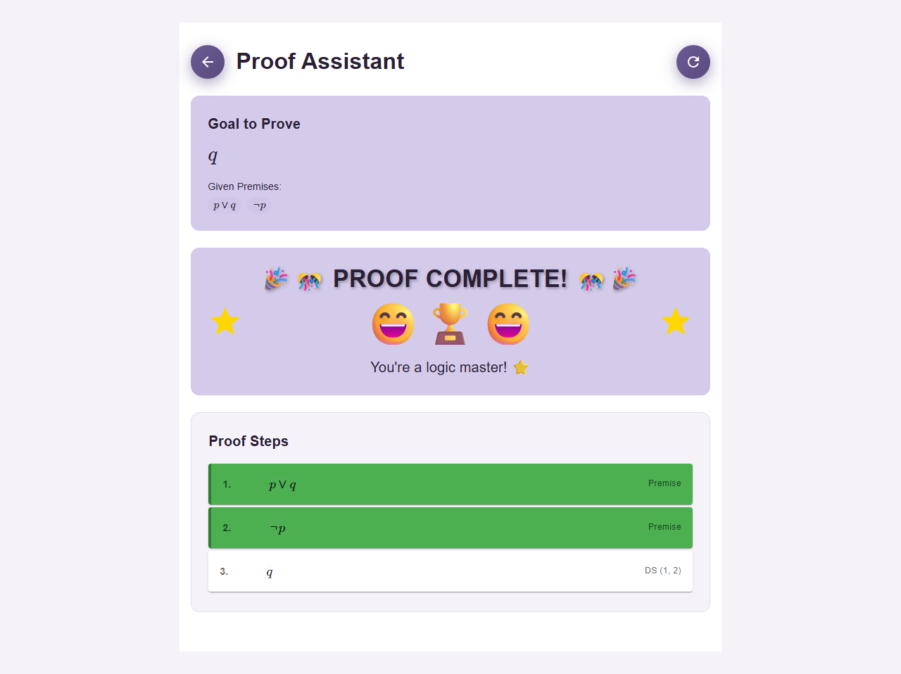

- **Goal:** `(p ∨ q) ∧ ¬p → q`
- **Premises:** None (custom goal)

| Step | Formula | Justification |
|------|---------|---------------|
| 1 | ┃ `(p ∨ q) ∧ ¬p` | Assume (opens subproof) |
| 2 | ┃ `p ∨ q` | ∧ Elimination Left (1) |
| 3 | ┃ `¬p` | ∧ Elimination Right (1) |
| 4 | ┃ `q` | Disjunctive Syllogism (2, 3) |
| 5 | `((p ∨ q) ∧ ¬p) → q` | → Introduction (1–4) |

**Key idea:** If one disjunct is negated, the other must hold.

---

### Proof 11: Multiple Conjunction Introductions

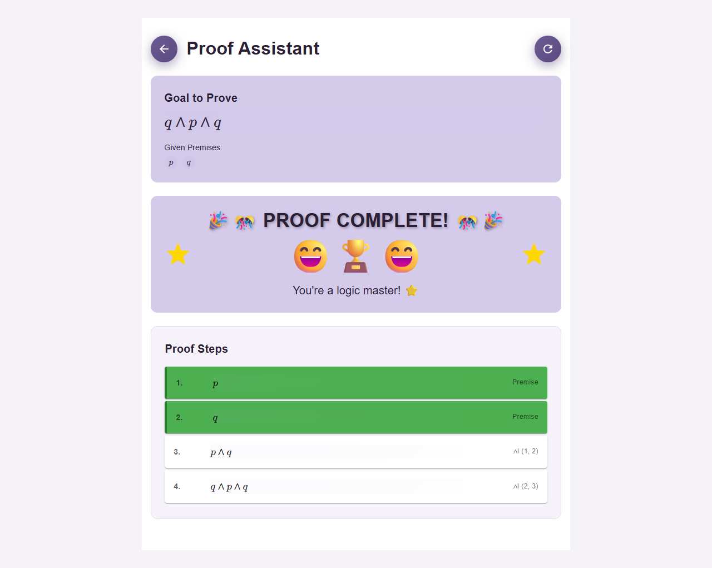

- **Goal:** `q ∧ (p ∧ q)`
- **Premises:** `p`, `q`
- **Knowledge Base:** Conjunction

| Step | Formula | Justification |
|------|---------|---------------|
| 1 | `p` | Premise |
| 2 | `q` | Premise |
| 3 | `p ∧ q` | ∧ Introduction (1, 2) |
| 4 | `q ∧ (p ∧ q)` | ∧ Introduction (2, 3) |

**Key idea:** Build nested conjunctions by applying ∧ Introduction multiple times.

---

## Level 3 — Subproofs with → Introduction (5–8 steps)

### Proof 12: Trivial Implication (Identity)

- **Goal:** `p → p`
- **Premises:** None

| Step | Formula | Justification |
|------|---------|---------------|
| 1 | ┃ `p` | Assume (opens subproof) |
| 2 | `p → p` | → Introduction (1–1) |

**Key idea:** The simplest conditional proof — assume `P`, immediately conclude `P → P`.

---

### Proof 13: Hypothetical Syllogism

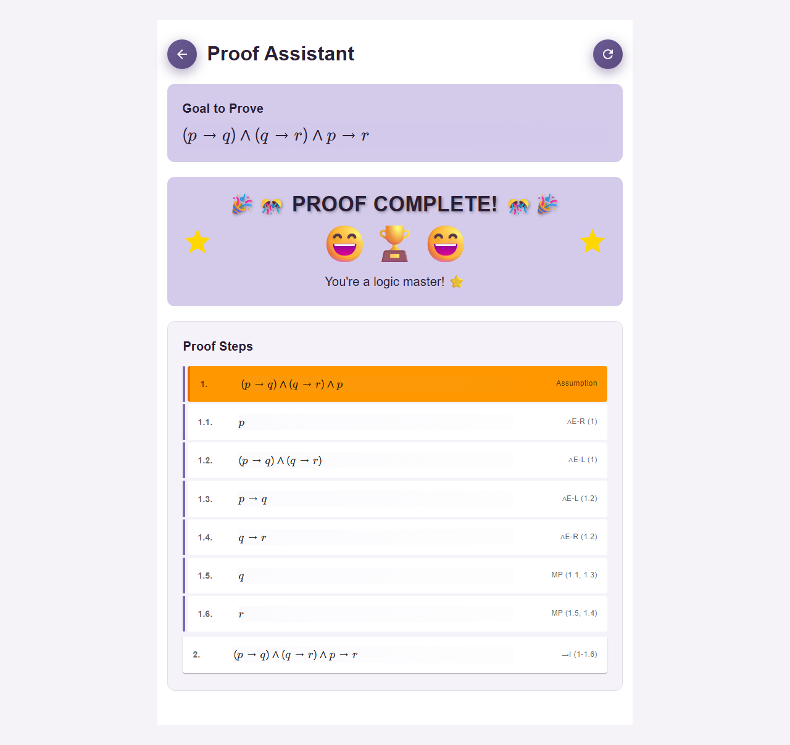

- **Goal:** `(p → q) ∧ (q → r) ∧ p → r`
- **Premises:** None (custom goal)

| Step | Formula | Justification |
|------|---------|---------------|
| 1 | ┃ `(p → q) ∧ (q → r) ∧ p` | Assume (opens subproof) |
| 2 | ┃ `p` | ∧ Elimination Right (1) |
| 3 | ┃ `(p → q) ∧ (q → r)` | ∧ Elimination Left (1) |
| 4 | ┃ `p → q` | ∧ Elimination Left (3) |
| 5 | ┃ `q → r` | ∧ Elimination Right (3) |
| 6 | ┃ `q` | Modus Ponens (2, 4) |
| 7 | ┃ `r` | Modus Ponens (6, 5) |
| 8 | `((p → q) ∧ (q → r) ∧ p) → r` | → Introduction (1–7) |

**Key idea:** A full encoding of hypothetical syllogism — if `P → Q` and `Q → R`, then `P → R`.

---

### Proof 14: Weakening

- **Goal:** `(p ∧ q) ∧ r → p ∧ r`
- **Premises:** None (custom goal)

| Step | Formula | Justification |
|------|---------|---------------|
| 1 | ┃ `(p ∧ q) ∧ r` | Assume (opens subproof) |
| 2 | ┃ `p ∧ q` | ∧ Elimination Left (1) |
| 3 | ┃ `r` | ∧ Elimination Right (1) |
| 4 | ┃ `p` | ∧ Elimination Left (2) |
| 5 | ┃ `p ∧ r` | ∧ Introduction (4, 3) |
| 6 | `((p ∧ q) ∧ r) → (p ∧ r)` | → Introduction (1–5) |

**Key idea:** Irrelevant conjuncts can be discarded — extract `p` and `r`, discard `q`.

---

### Proof 15: Extract Implication from Conjunction

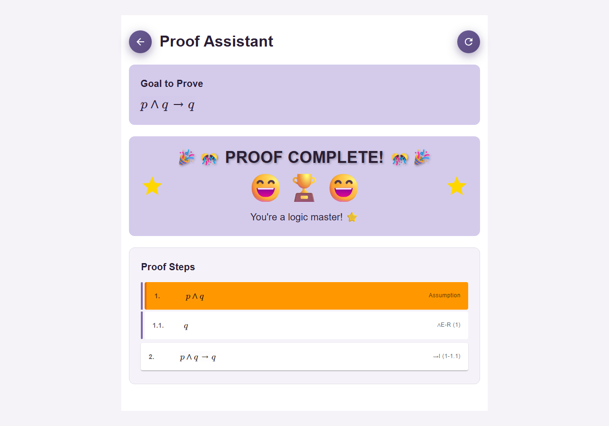

- **Goal:** `(p ∧ q) → q`
- **Premises:** None (custom goal)

| Step | Formula | Justification |
|------|---------|---------------|
| 1 | ┃ `p ∧ q` | Assume (opens subproof) |
| 2 | ┃ `q` | ∧ Elimination Right (1) |
| 3 | `(p ∧ q) → q` | → Introduction (1–2) |

**Key idea:** Any conjunct can be extracted as a consequence of the conjunction.

---

## Level 4 — Disjunction Elimination / Proof by Cases (8–12 steps)

### Proof 16: Classic Proof by Cases

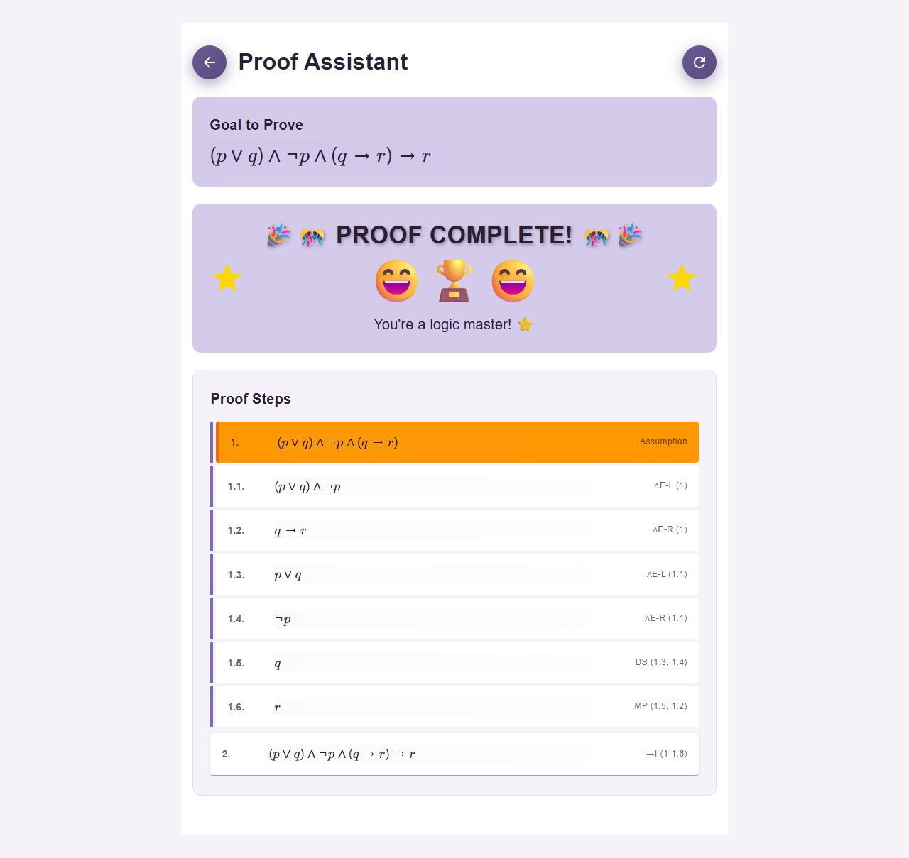

- **Goal:** `(p ∨ q) ∧ ¬p ∧ (q → r) → r`
- **Premises:** None (custom goal)

| Step | Formula | Justification |
|------|---------|---------------|
| 1 | ┃ `(p ∨ q) ∧ ¬p ∧ (q → r)` | Assume (opens subproof) |
| 2 | ┃ `(p ∨ q) ∧ ¬p` | ∧ Elimination Left (1) |
| 3 | ┃ `q → r` | ∧ Elimination Right (1) |
| 4 | ┃ `p ∨ q` | ∧ Elimination Left (2) |
| 5 | ┃ `¬p` | ∧ Elimination Right (2) |
| 6 | ┃ `q` | Disjunctive Syllogism (4, 5) |
| 7 | ┃ `r` | Modus Ponens (6, 3) |
| 8 | `((p ∨ q) ∧ ¬p ∧ (q → r)) → r` | → Introduction (1–7) |

**Key idea:** Eliminate one disjunct via negation (DS), then chain through an implication (MP).

---

### Proof 17: Disjunction Commutativity

- **Goal:** `(p ∨ q) ∧ ¬¬¬q → q ∨ p`
- **Premises:** None (custom goal)

| Step | Formula | Justification |
|------|---------|---------------|
| 1 | ┃ `(p ∨ q) ∧ ¬¬¬q` | Assume (opens subproof) |
| 2 | ┃ `p ∨ q` | ∧ Elimination Left (1) |
| 3 | ┃ `¬¬¬q` | ∧ Elimination Right (1) |
| 4 | ┃ `¬q` | Double Negation (3) |
| 5 | ┃ `p` | Disjunctive Syllogism (2, 4) |
| 6 | ┃ `q ∨ p` | ∨ Introduction Right (5), user provides `q` |
| 7 | `((p ∨ q) ∧ ¬¬¬q) → (q ∨ p)` | → Introduction (1–6) |

**Key idea:** Triple negation reduces to single negation via DN, then DS extracts the remaining disjunct, and ∨IR rebuilds in swapped order.

---

### Proof 18: Distribution of Disjunction over Conjunction

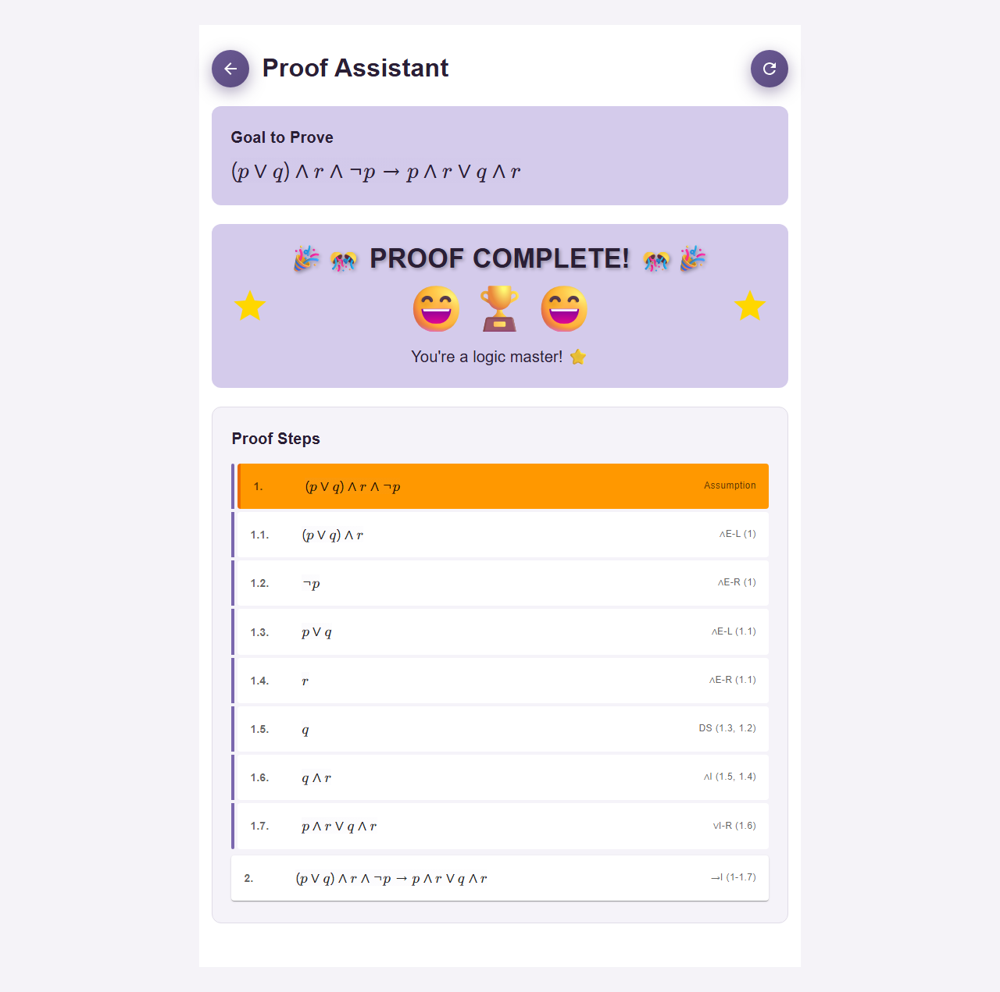

- **Goal:** `(p ∨ q) ∧ r ∧ ¬p → (p ∧ r) ∨ (q ∧ r)`
- **Premises:** None (custom goal)

| Step | Formula | Justification |
|------|---------|---------------|
| 1 | ┃ `(p ∨ q) ∧ r ∧ ¬p` | Assume (opens subproof) |
| 2 | ┃ `(p ∨ q) ∧ r` | ∧ Elimination Left (1) |
| 3 | ┃ `¬p` | ∧ Elimination Right (1) |
| 4 | ┃ `p ∨ q` | ∧ Elimination Left (2) |
| 5 | ┃ `r` | ∧ Elimination Right (2) |
| 6 | ┃ `q` | Disjunctive Syllogism (4, 3) |
| 7 | ┃ `q ∧ r` | ∧ Introduction (6, 5) |
| 8 | ┃ `(p ∧ r) ∨ (q ∧ r)` | ∨ Introduction Right (7), user provides `p ∧ r` |
| 9 | `((p ∨ q) ∧ r ∧ ¬p) → ((p ∧ r) ∨ (q ∧ r))` | → Introduction (1–8) |

**Key idea:** Distributes `r` into each disjunct of `p ∨ q`, resulting in `(p ∧ r) ∨ (q ∧ r)`.

---

## Level 5 — Nested Subproofs (10–15 steps)

### Proof 19: Currying (Conjunction Reordering)

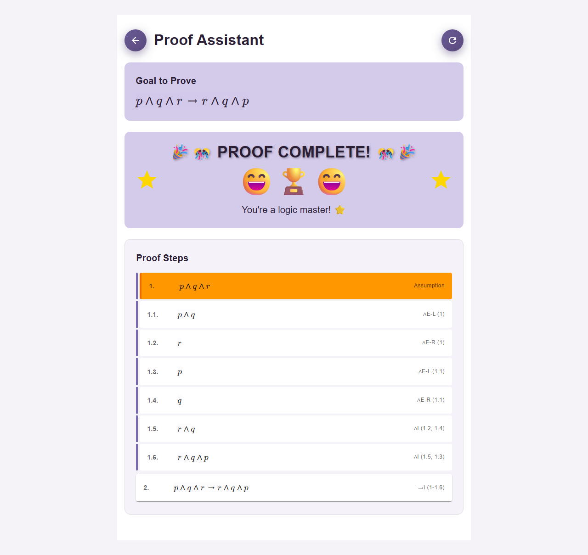

- **Goal:** `p ∧ q ∧ r → r ∧ q ∧ p`
- **Premises:** None (custom goal)

| Step | Formula | Justification |
|------|---------|---------------|
| 1 | ┃ `p ∧ q ∧ r` | Assume (opens subproof) |
| 2 | ┃ `p ∧ q` | ∧ Elimination Left (1) |
| 3 | ┃ `r` | ∧ Elimination Right (1) |
| 4 | ┃ `p` | ∧ Elimination Left (2) |
| 5 | ┃ `q` | ∧ Elimination Right (2) |
| 6 | ┃ `r ∧ q` | ∧ Introduction (3, 5) |
| 7 | ┃ `(r ∧ q) ∧ p` | ∧ Introduction (6, 4) |
| 8 | `(p ∧ q ∧ r) → ((r ∧ q) ∧ p)` | → Introduction (1–7) |

**Key idea:** Decompose a conjunction fully, then rebuild in reverse order — demonstrates conjunction commutativity/associativity.

---

### Proof 20: Uncurrying

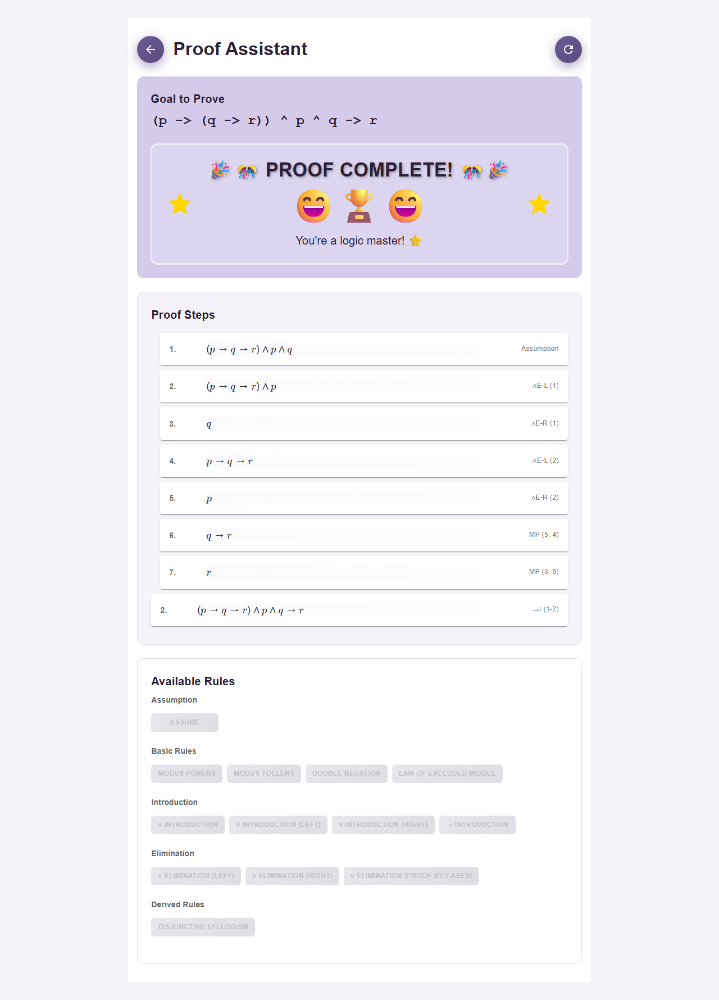

- **Goal:** `(p → (q → r)) ∧ p ∧ q → r`
- **Premises:** None (custom goal)

| Step | Formula | Justification |
|------|---------|---------------|
| 1 | ┃ `(p → (q → r)) ∧ p ∧ q` | Assume (opens subproof) |
| 2 | ┃ `(p → (q → r)) ∧ p` | ∧ Elimination Left (1) |
| 3 | ┃ `q` | ∧ Elimination Right (1) |
| 4 | ┃ `p → (q → r)` | ∧ Elimination Left (2) |
| 5 | ┃ `p` | ∧ Elimination Right (2) |
| 6 | ┃ `q → r` | Modus Ponens (5, 4) |
| 7 | ┃ `r` | Modus Ponens (3, 6) |
| 8 | `((p → (q → r)) ∧ p ∧ q) → r` | → Introduction (1–7) |

**Key idea:** Flatten a nested implication `P → (Q → R)` by providing both arguments `P` and `Q` to obtain `R`.

---

### Proof 21: Contrapositive

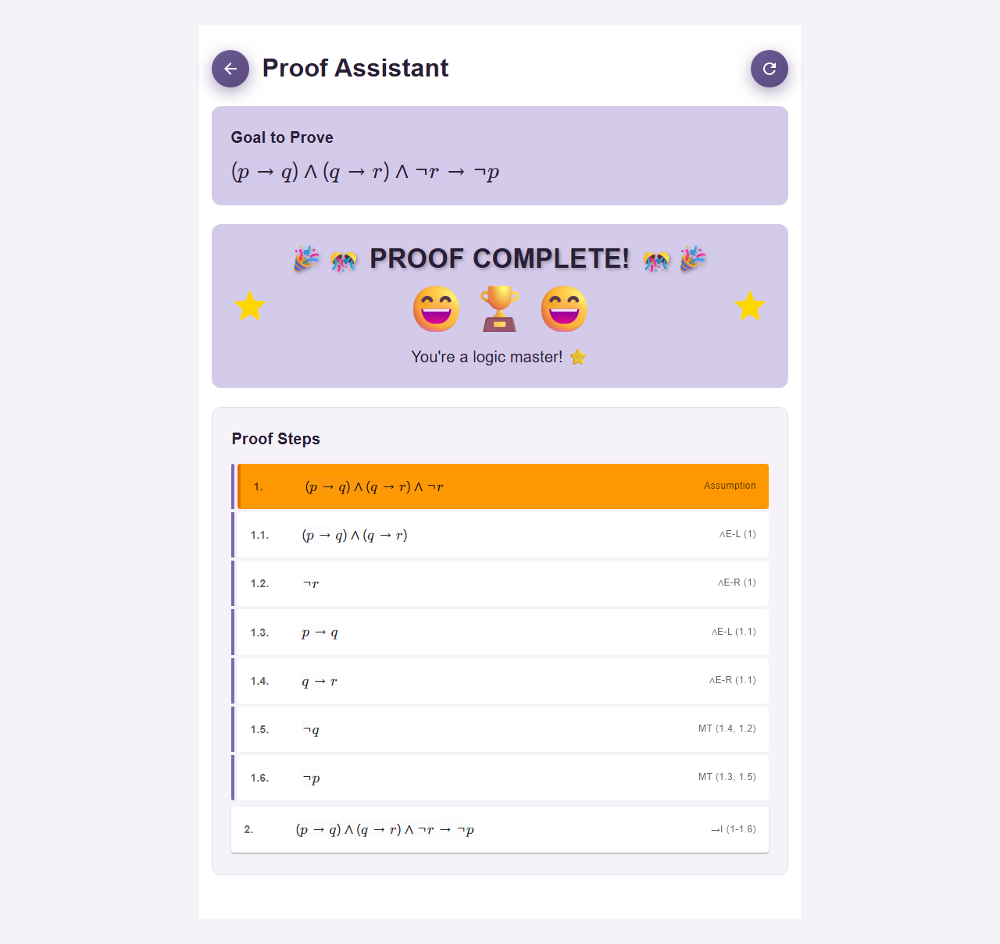

- **Goal:** `(p → q) ∧ (q → r) ∧ ¬r → ¬p`
- **Premises:** None (custom goal)

| Step | Formula | Justification |
|------|---------|---------------|
| 1 | ┃ `(p → q) ∧ (q → r) ∧ ¬r` | Assume (opens subproof) |
| 2 | ┃ `(p → q) ∧ (q → r)` | ∧ Elimination Left (1) |
| 3 | ┃ `¬r` | ∧ Elimination Right (1) |
| 4 | ┃ `p → q` | ∧ Elimination Left (2) |
| 5 | ┃ `q → r` | ∧ Elimination Right (2) |
| 6 | ┃ `¬q` | Modus Tollens (5, 3) |
| 7 | ┃ `¬p` | Modus Tollens (4, 6) |
| 8 | `((p → q) ∧ (q → r) ∧ ¬r) → ¬p` | → Introduction (1–7) |

**Key idea:** Chain Modus Tollens backwards through a sequence of implications — the contrapositive of hypothetical syllogism.

---

## Level 6 — Law of Excluded Middle + Complex Logic (12–20 steps)

### Proof 22: Constructive Dilemma

- **Goal:** `(p → q) ∧ (¬p → q) ∧ ¬¬p → q`
- **Premises:** None (custom goal)

| Step | Formula | Justification |
|------|---------|---------------|
| 1 | ┃ `(p → q) ∧ (¬p → q) ∧ ¬¬p` | Assume (opens subproof) |
| 2 | ┃ `(p → q) ∧ (¬p → q)` | ∧ Elimination Left (1) |
| 3 | ┃ `¬¬p` | ∧ Elimination Right (1) |
| 4 | ┃ `p → q` | ∧ Elimination Left (2) |
| 5 | ┃ `p ∨ ¬p` | Law of Excluded Middle (`p`) |
| 6 | ┃ `p` | Disjunctive Syllogism (5, 3) |
| 7 | ┃ `q` | Modus Ponens (6, 4) |
| 8 | `((p → q) ∧ (¬p → q) ∧ ¬¬p) → q` | → Introduction (1–7) |

**Key idea:** When both `P → Q` and `¬P → Q` hold, `Q` is inevitable. Uses LEM to establish `P ∨ ¬P`, then resolves with DS.

---

### Proof 23: Double Negation with LEM

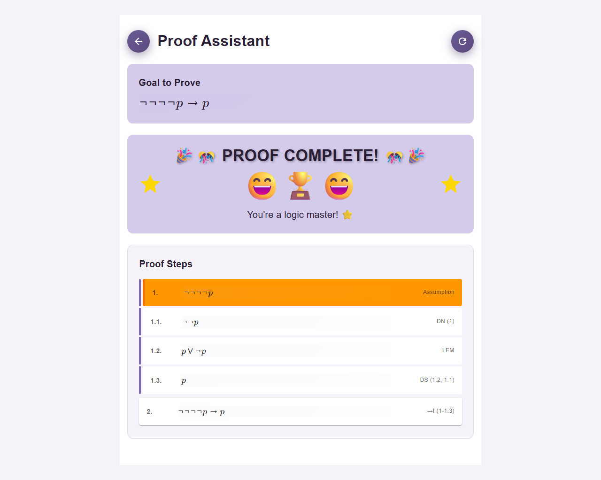

- **Goal:** `¬¬¬¬p → p`
- **Premises:** None (custom goal)

| Step | Formula | Justification |
|------|---------|---------------|
| 1 | ┃ `¬¬¬¬p` | Assume (opens subproof) |
| 2 | ┃ `¬¬p` | Double Negation (1) |
| 3 | ┃ `p ∨ ¬p` | Law of Excluded Middle (`p`) |
| 4 | ┃ `p` | Disjunctive Syllogism (3, 2) |
| 5 | `¬¬¬¬p → p` | → Introduction (1–4) |

**Key idea:** Quadruple negation reduces via DN to double negation, then LEM + DS extracts `p`.

---

### Proof 24: LEM Introduction

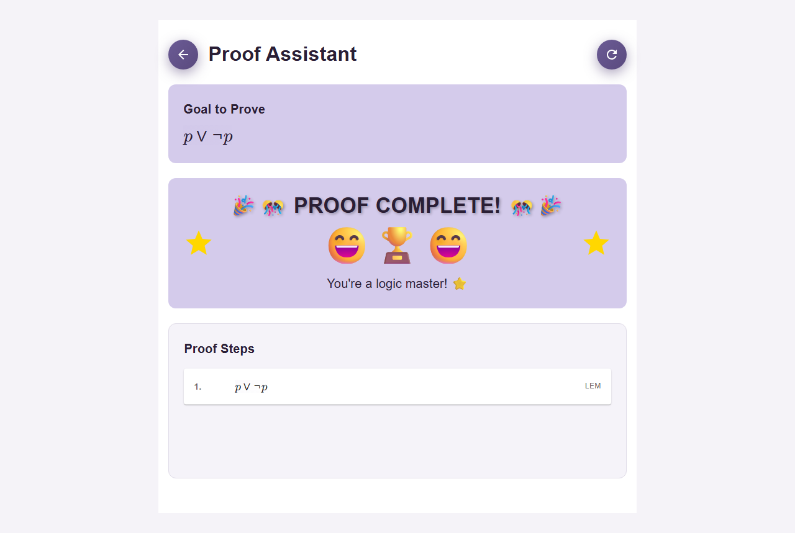

- **Goal:** `p ∨ ¬p`
- **Premises:** None

| Step | Formula | Justification |
|------|---------|---------------|
| 1 | `p ∨ ¬p` | Law of Excluded Middle (`p`) |

**Key idea:** The simplest classical tautology — every proposition is either true or false.

---

### Proof 25: Material Implication

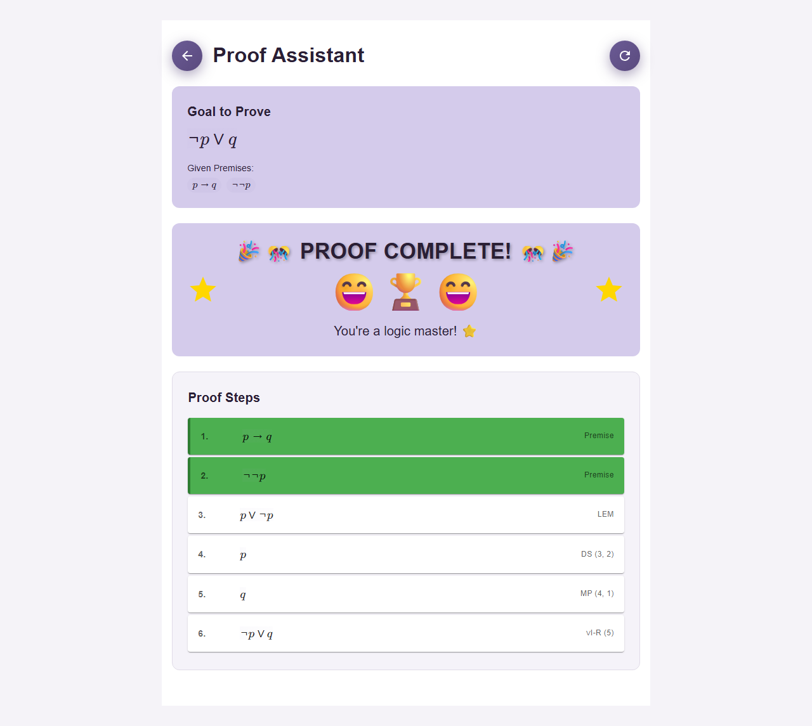

- **Goal:** `(p → q) ∧ ¬¬p → ¬p ∨ q`
- **Premises:** None (custom goal)

| Step | Formula | Justification |
|------|---------|---------------|
| 1 | ┃ `(p → q) ∧ ¬¬p` | Assume (opens subproof) |
| 2 | ┃ `p → q` | ∧ Elimination Left (1) |
| 3 | ┃ `¬¬p` | ∧ Elimination Right (1) |
| 4 | ┃ `p ∨ ¬p` | Law of Excluded Middle (`p`) |
| 5 | ┃ `p` | Disjunctive Syllogism (4, 3) |
| 6 | ┃ `q` | Modus Ponens (5, 2) |
| 7 | ┃ `¬p ∨ q` | ∨ Introduction Right (6), user provides `¬p` |
| 8 | `((p → q) ∧ ¬¬p) → (¬p ∨ q)` | → Introduction (1–7) |

**Key idea:** The classical equivalence `P → Q ⟺ ¬P ∨ Q` (material implication). Derives the disjunctive form from the conditional.

---

## Level 7 — Very Complex Proofs (15–25+ steps)

### Proof 26: Peirce's Law

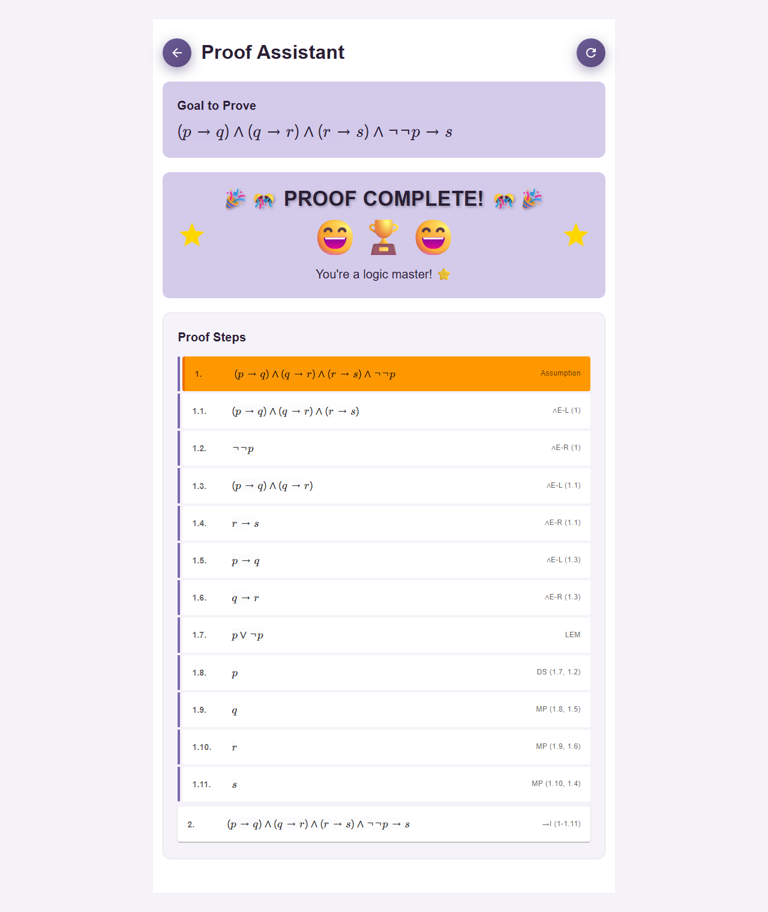

- **Goal:** `(p → q) ∧ (q → r) ∧ (r → s) ∧ ¬¬p → s`
- **Premises:** None (custom goal)

| Step | Formula | Justification |
|------|---------|---------------|
| 1 | ┃ `(p → q) ∧ (q → r) ∧ (r → s) ∧ ¬¬p` | Assume (opens subproof) |
| 2 | ┃ `((p → q) ∧ (q → r)) ∧ (r → s)` | ∧ Elimination Left (1) |
| 3 | ┃ `¬¬p` | ∧ Elimination Right (1) |
| 4 | ┃ `(p → q) ∧ (q → r)` | ∧ Elimination Left (2) |
| 5 | ┃ `r → s` | ∧ Elimination Right (2) |
| 6 | ┃ `p → q` | ∧ Elimination Left (4) |
| 7 | ┃ `q → r` | ∧ Elimination Right (4) |
| 8 | ┃ `p ∨ ¬p` | Law of Excluded Middle (`p`) |
| 9 | ┃ `p` | Disjunctive Syllogism (8, 3) |
| 10 | ┃ `q` | Modus Ponens (9, 6) |
| 11 | ┃ `r` | Modus Ponens (10, 7) |
| 12 | ┃ `s` | Modus Ponens (11, 5) |
| 13 | `((p → q) ∧ (q → r) ∧ (r → s) ∧ ¬¬p) → s` | → Introduction (1–12) |

**Key idea:** A four-link implication chain `P → Q → R → S` combined with LEM to extract `P` from `¬¬P`, then three consecutive Modus Ponens applications.

---

### Proof 27: Double Negation of LEM

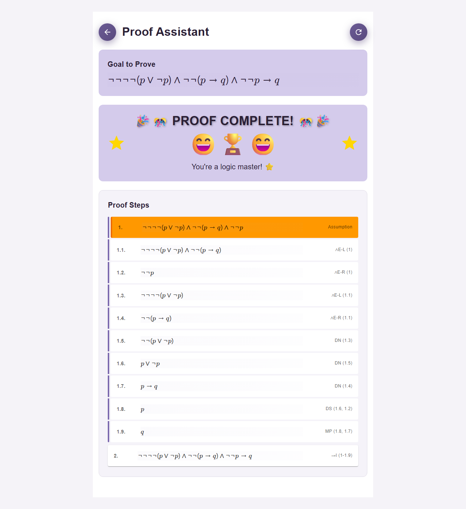

- **Goal:** `¬¬¬¬(p ∨ ¬p) ∧ ¬¬(p → q) ∧ ¬¬p → q`
- **Premises:** None (custom goal)

| Step | Formula | Justification |
|------|---------|---------------|
| 1 | ┃ `¬¬¬¬(p ∨ ¬p) ∧ ¬¬(p → q) ∧ ¬¬p` | Assume (opens subproof) |
| 2 | ┃ `¬¬¬¬(p ∨ ¬p) ∧ ¬¬(p → q)` | ∧ Elimination Left (1) |
| 3 | ┃ `¬¬p` | ∧ Elimination Right (1) |
| 4 | ┃ `¬¬¬¬(p ∨ ¬p)` | ∧ Elimination Left (2) |
| 5 | ┃ `¬¬(p → q)` | ∧ Elimination Right (2) |
| 6 | ┃ `¬¬(p ∨ ¬p)` | Double Negation (4) |
| 7 | ┃ `p ∨ ¬p` | Double Negation (6) |
| 8 | ┃ `p → q` | Double Negation (5) |
| 9 | ┃ `p` | Disjunctive Syllogism (7, 3) |
| 10 | ┃ `q` | Modus Ponens (9, 8) |
| 11 | `(¬¬¬¬(p ∨ ¬p) ∧ ¬¬(p → q) ∧ ¬¬p) → q` | → Introduction (1–10) |

**Key idea:** Multiple layers of double negation must be peeled off (three DN applications) before the core logic (DS + MP) can be applied.

---

### Proof 28: Reverse Proof by Cases

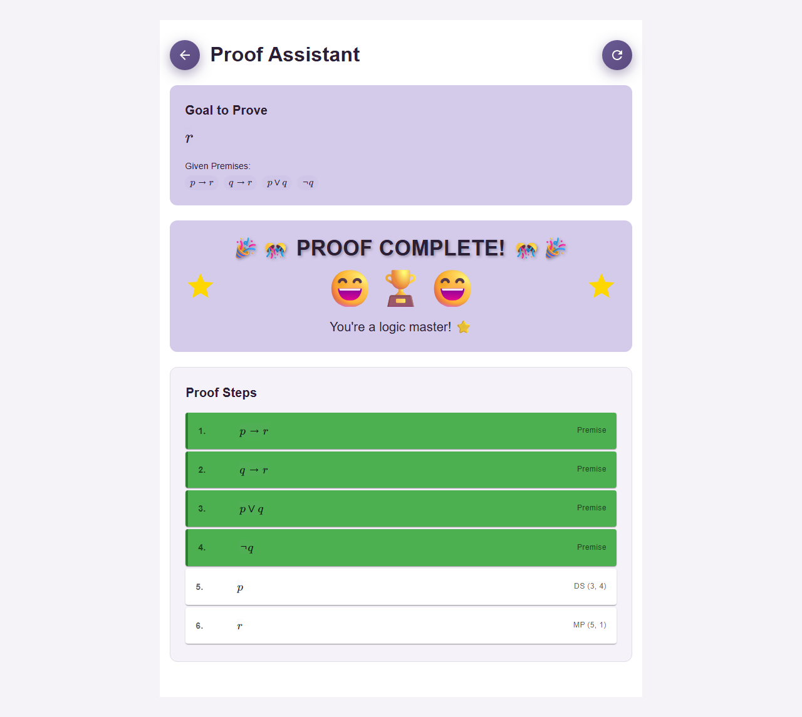

- **Goal:** `(p → r) ∧ (q → r) ∧ (p ∨ q) ∧ ¬q → r`
- **Premises:** None (custom goal)

| Step | Formula | Justification |
|------|---------|---------------|
| 1 | ┃ `(p → r) ∧ (q → r) ∧ (p ∨ q) ∧ ¬q` | Assume (opens subproof) |
| 2 | ┃ `((p → r) ∧ (q → r)) ∧ (p ∨ q)` | ∧ Elimination Left (1) |
| 3 | ┃ `¬q` | ∧ Elimination Right (1) |
| 4 | ┃ `(p → r) ∧ (q → r)` | ∧ Elimination Left (2) |
| 5 | ┃ `p ∨ q` | ∧ Elimination Right (2) |
| 6 | ┃ `p → r` | ∧ Elimination Left (4) |
| 7 | ┃ `q → r` | ∧ Elimination Right (4) |
| 8 | ┃ `p` | Disjunctive Syllogism (5, 3) |
| 9 | ┃ `r` | Modus Ponens (8, 6) |
| 10 | `((p → r) ∧ (q → r) ∧ (p ∨ q) ∧ ¬q) → r` | → Introduction (1–9) |

**Key idea:** Both branches converge to `r`, but only one is needed. DS eliminates `q` via `¬q`, leaving `p`, and `p → r` delivers the conclusion. (`q → r` is present but unused.)

---

### Proof 29: Complex Nested Reasoning

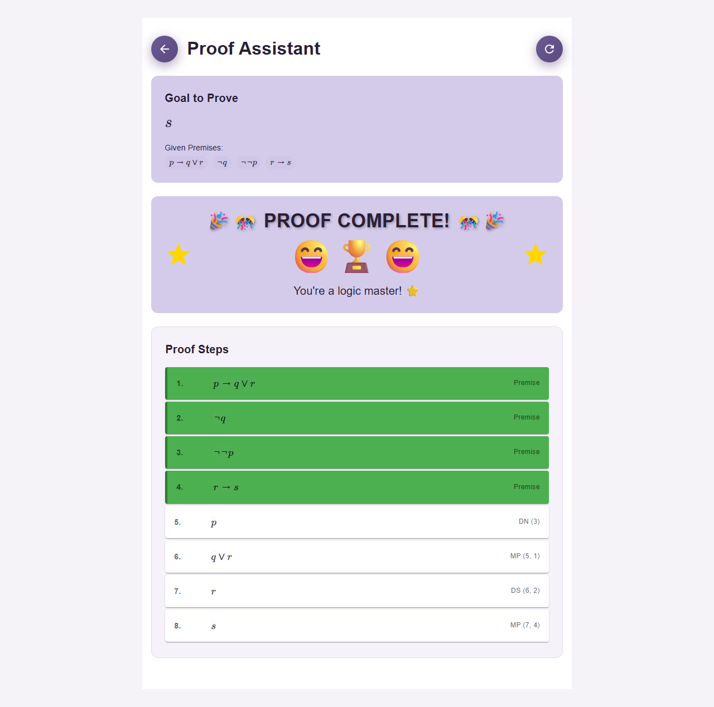

- **Goal:** `(p → (q ∨ r)) ∧ ¬q ∧ ¬¬p ∧ (r → s) → s`
- **Premises:** None (custom goal)

| Step | Formula | Justification |
|------|---------|---------------|
| 1 | ┃ `(p → (q ∨ r)) ∧ ¬q ∧ ¬¬p ∧ (r → s)` | Assume (opens subproof) |
| 2 | ┃ `((p → (q ∨ r)) ∧ ¬q) ∧ ¬¬p` | ∧ Elimination Left (1) |
| 3 | ┃ `r → s` | ∧ Elimination Right (1) |
| 4 | ┃ `(p → (q ∨ r)) ∧ ¬q` | ∧ Elimination Left (2) |
| 5 | ┃ `¬¬p` | ∧ Elimination Right (2) |
| 6 | ┃ `p → (q ∨ r)` | ∧ Elimination Left (4) |
| 7 | ┃ `¬q` | ∧ Elimination Right (4) |
| 8 | ┃ `p` | Double Negation (5) |
| 9 | ┃ `q ∨ r` | Modus Ponens (8, 6) |
| 10 | ┃ `r` | Disjunctive Syllogism (9, 7) |
| 11 | ┃ `s` | Modus Ponens (10, 3) |
| 12 | `((p → (q ∨ r)) ∧ ¬q ∧ ¬¬p ∧ (r → s)) → s` | → Introduction (1–11) |

**Key idea:** Combines four techniques in sequence: DN extracts `p`, MP yields disjunction `q ∨ r`, DS eliminates `q` leaving `r`, and a final MP derives `s`.

---

### Proof 30: Implication Transitivity

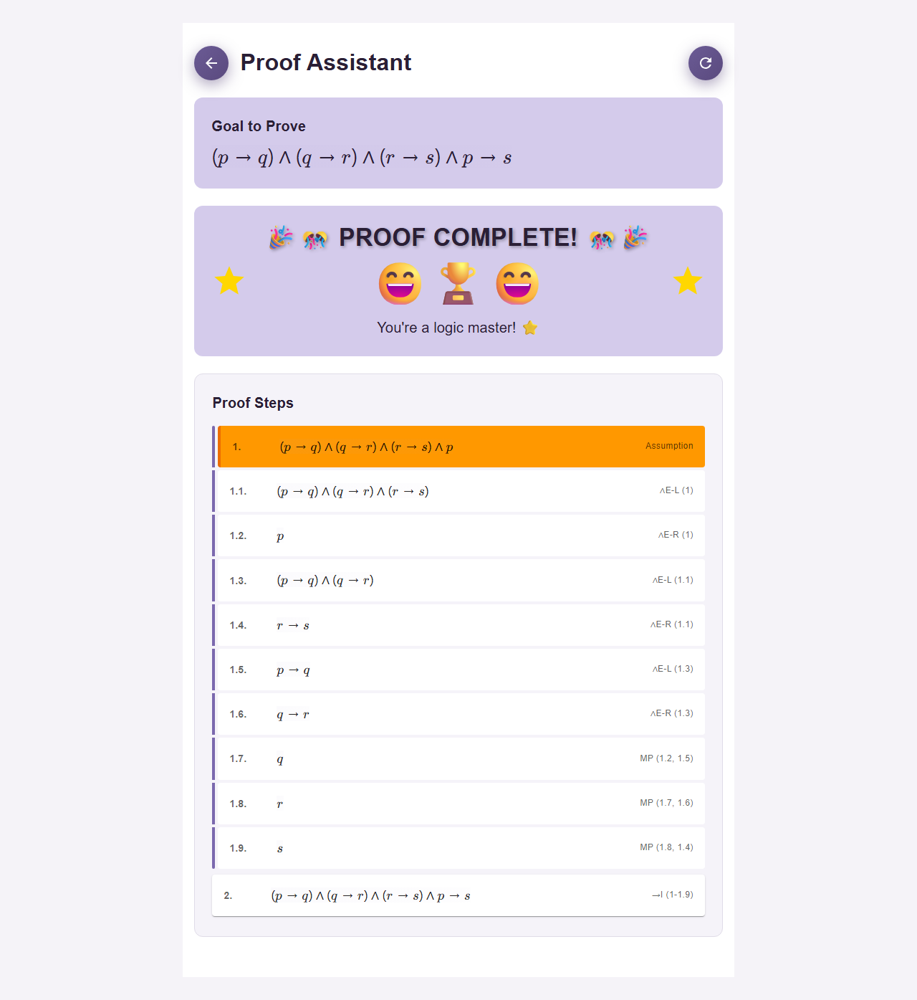

- **Goal:** `(p → q) ∧ (q → r) ∧ (r → s) ∧ p → s`
- **Premises:** None (custom goal)

| Step | Formula | Justification |
|------|---------|---------------|
| 1 | ┃ `(p → q) ∧ (q → r) ∧ (r → s) ∧ p` | Assume (opens subproof) |
| 2 | ┃ `((p → q) ∧ (q → r)) ∧ (r → s)` | ∧ Elimination Left (1) |
| 3 | ┃ `p` | ∧ Elimination Right (1) |
| 4 | ┃ `(p → q) ∧ (q → r)` | ∧ Elimination Left (2) |
| 5 | ┃ `r → s` | ∧ Elimination Right (2) |
| 6 | ┃ `p → q` | ∧ Elimination Left (4) |
| 7 | ┃ `q → r` | ∧ Elimination Right (4) |
| 8 | ┃ `q` | Modus Ponens (3, 6) |
| 9 | ┃ `r` | Modus Ponens (8, 7) |
| 10 | ┃ `s` | Modus Ponens (9, 5) |
| 11 | `((p → q) ∧ (q → r) ∧ (r → s) ∧ p) → s` | → Introduction (1–10) |

**Key idea:** Pure transitivity — three Modus Ponens applications chain `p → q → r → s` together with premise `p` to reach `s`.

---

## Summary

| # | Level | Name | Goal | Steps | Main Rules |
|---|-------|------|------|-------|------------|
| 1 | 1 | Basic Modus Ponens | `q` | 3 | MP |
| 2 | 1 | Conjunction Intro | `p ∧ q` | 3 | ∧I |
| 3 | 1 | Conj Elim Left | `p` | 2 | ∧EL |
| 4 | 1 | Conj Elim Right | `q` | 2 | ∧ER |
| 5 | 1 | Disjunct Intro Left | `p ∨ q` | 2 | ∨IL |
| 6 | 1 | Double Negation | `¬¬p → p` | 3 | DN, →I |
| 7 | 2 | Chained Modus Ponens | `r` | 5 | MP ×2 |
| 8 | 2 | Conj Elim + MP | `((p∧q)∧(q→r)) → r` | 6 | ∧E, MP, →I |
| 9 | 2 | Modus Tollens | `((p→q)∧¬q) → ¬p` | 5 | ∧E, MT, →I |
| 10 | 2 | Disjunctive Syllogism | `((p∨q)∧¬p) → q` | 5 | ∧E, DS, →I |
| 11 | 2 | Multiple ∧ Intros | `q ∧ (p ∧ q)` | 4 | ∧I ×2 |
| 12 | 3 | Trivial Implication | `p → p` | 2 | →I |
| 13 | 3 | Hypothetical Syllogism | `(…) → r` | 8 | ∧E, MP ×2, →I |
| 14 | 3 | Weakening | `((p∧q)∧r) → (p∧r)` | 6 | ∧E, ∧I, →I |
| 15 | 3 | Extract from Conj | `(p∧q) → q` | 3 | ∧ER, →I |
| 16 | 4 | Classic Proof by Cases | `(…) → r` | 8 | ∧E, DS, MP, →I |
| 17 | 4 | Disj Commutativity | `(…) → q∨p` | 7 | DN, DS, ∨IR, →I |
| 18 | 4 | Distribution | `(…) → (p∧r)∨(q∧r)` | 9 | DS, ∧I, ∨IR, →I |
| 19 | 5 | Currying | `(p∧q∧r) → (r∧q∧p)` | 8 | ∧E, ∧I ×2, →I |
| 20 | 5 | Uncurrying | `(…) → r` | 8 | ∧E, MP ×2, →I |
| 21 | 5 | Contrapositive | `(…) → ¬p` | 8 | ∧E, MT ×2, →I |
| 22 | 6 | Constructive Dilemma | `(…) → q` | 8 | LEM, DS, MP, →I |
| 23 | 6 | DN with LEM | `¬¬¬¬p → p` | 5 | DN, LEM, DS, →I |
| 24 | 6 | LEM Introduction | `p ∨ ¬p` | 1 | LEM |
| 25 | 6 | Material Implication | `(…) → ¬p∨q` | 8 | LEM, DS, MP, ∨IR, →I |
| 26 | 7 | Peirce's Law | `(…) → s` | 13 | LEM, DS, MP ×3, →I |
| 27 | 7 | DN of LEM | `(…) → q` | 11 | DN ×3, DS, MP, →I |
| 28 | 7 | Reverse Proof by Cases | `(…) → r` | 10 | ∧E, DS, MP, →I |
| 29 | 7 | Complex Nested | `(…) → s` | 12 | DN, MP ×2, DS, →I |
| 30 | 7 | Implication Transitivity | `(…) → s` | 11 | ∧E, MP ×3, →I |
